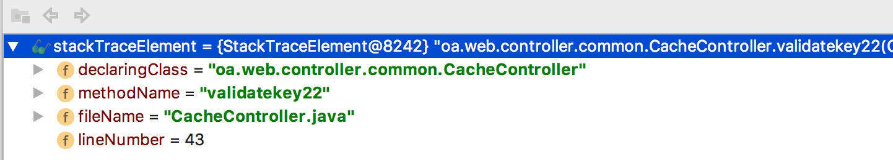

# oa_framework
springMVC公共的控制器方法
 ---
里面的控制器不能以"/"或"" 或 /entity 作为路由
## 为什么不能以/entity 作为路由呢?
因为oa/web/controller/generic/GenericSuperHWController.java 中
已经提供了接口:
1. /entity/{entity}/{cmd}
2. /entity/{entity}/{id}/{cmd}
## 注意
list 接口非常慢的原因 见
oa/service/DictionaryParam.java 的String get(String groupId, String key) 方法:
``` java
Thread.sleep(3000);//等待执行init() 方法
```

## 登录
Constant2.REDIS_KEY_ACCESS_TOKEN 对应的是user对象的json字符串

## 在拦截器中如何向控制器接口传递数据
通过GenericController 中handlerMethodCacheData 字段,handlerMethodCacheData 使用了ThreadLocal,
所以是线程安全的.
1. 接口增加一个类似于model的东西，但是是应用于请求的，拦截器aop可以往里面塞内容
   根本原因是:
   request不能被编辑
2. 示例:
```java
@Override
    public boolean preHandle(HttpServletRequest request, HttpServletResponse response, Object handler) throws Exception {
        if (handler instanceof HandlerMethod) {
            HandlerMethod handlerMethod = (HandlerMethod) handler;
            Object beanObj = handlerMethod.getBean();
            if (request.getRequestURI().endsWith("/test/list")) {
                Test2BoyController controller = (Test2BoyController) beanObj;
                HashMap<String, String> hashMap = new HashMap<>();
                hashMap.put("message", "成功了,333");
                controller.setHandlerMethodCacheData(hashMap);
            }

            Method method = handlerMethod.getMethod();
            System.out.println("Method name :" + method.getName());
            return true;
        } else {
            return super.preHandle(request, response, handler);
        }
    }
```
## 有哪些可以访问的接口
后台,只要控制器继承GenericController,就会自动获取如下接口:
-------------
|接口|请求方式|功能|返回格式|
| -------- | -------------- |---------- |---------- |
|[/{entity}/add]()|get|进入添加页面|页面|
|[/{entity}/add]()|post|保存(新增一条记录)|页面|
|[/{entity}/add/json]()|get/post|保存(新增一条记录)|json|
|[/{entity}/{id}]()|get/post|详情|页面|
|[/{entity}/{id}/json]()|get/post|详情|json|
|[/{entity}/{id}/json/{column}]()|get/post|获取单个成员变量(属性)的值|json|
|[/{entity}/{id}/delete]()|get/post|删除一条记录|页面|
|[/{entity}/{id}/delete/json]()|get/post|删除一条记录|json|
|[/{entity}/{id}/edit]()|get|进入编辑页面|页面|
|[/{entity}/{id}/update]()|post|更新一条记录|页面|
|[/{entity}/{id}/update/json/{column}]()|get/post|更新单个字段(属性)|json|
|[/{entity}/{id}/update/json/{column}/val/{val}]()|get/post|更新单个字段(属性)|json|
|[/{entity}/{id}/update/json]()|post|更新一条记录|json|
|[/{entity}/list/page/{currentPage}]()|get|查询分页|页面|
|[/{entity}/list]()|get|列表|页面|
|[/{entity}/save/json]()|get/post|保存(新增一条记录)|json|
|[/{entity}/list/json]()|get|列表|json|
 
 添加或更新数据时,若请求参数reqtype=json,则表示请求体就是json串,而不是普通的表单提交

## 自动生成DAO 和 Controller
调用很简单
```java
@Test
    public final void test_generateDao() {
        String packageName="com.girltest.entity";
        CodeGenerateHelper.generateDaoFile(packageName,false);
    }
```
### 参数说明
1. 第一个参数packageName: 实体类包名,例如:com.xxx.entity,
那么生成的DAO的包名就是com.xxx.dao,
控制器的包名就是:com.xxx.web.controller
2. 第二个参数overwrite:表示是否覆盖已存在的文件,
如果overwrite为true,那么会直接覆盖已存在的DAO或Controller

## 上传文件
要做两部分工作:
1. 控制器实现UploadGenericController
例如:

```java
@Controller
@RequestMapping("/ajax_image")
public class AjaxUploadImageController extends UploadGenericController {

    @Override
    public UploadCallback getUploadCallback() {
        return new AjaxImageUploadCallback();
    }

    @Override
    protected void beforeAddInput(Model model, HttpServletRequest request) {

    }

    @Override
    protected void errorDeal(Model model) {

    }

    @Override
    public String getJspFolder() {
        return null;
    }

    @RequestMapping(value = "/convention")
    public String index(Model model) {

        return "public/upload_img";
    }
}
```
2. callback 要实现UploadCallback
例如:
```java
public class AjaxImageUploadCallback implements UploadCallback {
    protected final static Logger logger = Logger.getLogger(AjaxImageUploadCallback.class);


    @Override
    public String callback(Model model, MultipartFile file, HttpServletRequest request, HttpServletResponse response)
            throws ParseException, IOException {
        Map map = HWUtils.getUploadResultMap(file, request, HWUtils.isSameFileName(request), false, null);
        model.addAllAttributes(map);
        String content = HWJacksonUtils.getJsonP(map);
        writeResponse(response, content);
        logger.info(content);
        return null;
    }

    @Override
    public String callback(Model model, MultipartFile[] files, HttpServletRequest request, HttpServletResponse response)
            throws ParseException, IOException {
        String content = null;
        if (!ValueWidget.isNullOrEmpty(files)) {
            List<Map> picMapList = new ArrayList<Map>();
            int length = files.length;
            String isEscapestr = request.getParameter("escape");
            boolean isEscape = SystemHWUtil.parse2Boolean(isEscapestr);
            System.out.println("AjaxImageUploadCallback isEscapestr :" + isEscapestr);
            String sameFileNameStr = request.getParameter(Constant2.PARAMETER_SAME_FILE_NAME);
            System.out.println("sameFileName :" + sameFileNameStr);
            for (int i = 0; i < length; i++) {
                MultipartFile file = files[i];
                Map map = HWUtils.getUploadResultMap(file, request, HWUtils.isSameFileName(request), false, null, isEscape);
                picMapList.add(map);
            }
            model.addAttribute("picMapList", picMapList);
            /**
             * [{"fileName":"20170308201110_134_3C71E7EBAE9F48CEF1FE4A675E43F32B.jpg","fullUrl":"http://localhost:8080/upload/image/20170308201110_134_3C71E7EBAE9F48CEF1FE4A675E43F32B.jpg","relativePath":"/upload/image/20170308201110_134_3C71E7EBAE9F48CEF1FE4A675E43F32B.jpg","remoteAbsolutePath":"/Users/whuanghkl/code/mygit/convention/src/main/webapp/upload/image/20170308201110_134_3C71E7EBAE9F48CEF1FE4A675E43F32B.jpg","imgTag":"&lt;img style=&quot;max-width: 99%&quot; src=&quot;http://localhost:8080/upload/image/20170308201110_134_3C71E7EBAE9F48CEF1FE4A675E43F32B.jpg&quot; alt=&quot;不是图片,无法显示&quot;&gt;","url":"//upload/image/20170308201110_134_3C71E7EBAE9F48CEF1FE4A675E43F32B.jpg"}]
             */
            content = HWJacksonUtils.getJsonP(picMapList);
//            accessLog.setReserved(oldAnswer);
        }

        writeResponse(response, content);
        logger.info(content);
         /*response.setCharacterEncoding(SystemHWUtil.CHARSET_UTF);//必不可少,要不然中文乱码
         PrintWriter writer=response.getWriter();
		 writer.write(content);
		 writer.close();*/
        return null;
    }

    public static void writeResponse(HttpServletResponse response, String content) throws IOException {
        response.setCharacterEncoding(SystemHWUtil.CHARSET_UTF);
        response.setContentType(SystemHWUtil.RESPONSE_CONTENTTYPE_JSON_UTF);
        PrintWriter out = response.getWriter();
        out.print(content);
        out.flush();
    }
}
```
### 注意:
上传文件的表单名称是:image223
例如:
```html
<input type="file" id="pic-file" name="image223" multiple >
```

## 通用功能
1. 通用字段查询器
    1. 使用方法:继承DatabaseCustomizedController(支持泛型) 即可
    2. 接口地址:/{entity}/map or /{entity}/arr
    
2. svn 更新接口
接口:/svn/update?folder2update={要更新的目录}

## 异常捕获
### @ExceptionHandler
@ExceptionHandler 支持的参数
1. ServletResponse.class
2. OutputStream.class
3. Writer.class
4. WebRequest.class
5. ServletRequest.class
6. MultipartRequest.class
7. HttpSession.class
8. Principal.class
9. Locale.class
10. InputStream.class
11. Reader.class
 ---
 
 see oa.web.controller.handler.BusinessExceptionHandlerAdvice
 
 ### 如何判断应该返回json还是跳转错误页面
 通过异常的堆栈StackTraceElement
 
 --- 
 StackTraceElement 中包含哪些信息呢?
 
 所以我们可以通过反射获取控制器方法,然后判断是否有注解ResponseBody
 核心方法:
 
 ```java
/***
     * 判断接口的注解是否是ResponseBody,是,那么返回json,而不是跳转错误页面
     * @param stackTraceElement
     * @return
     */
    public static boolean isControllerAction(StackTraceElement stackTraceElement) {
        String className = stackTraceElement.getClassName();
        if (className.endsWith("Controller")) {
            try {
                Class controllerClass = Class.forName(className);
                Method actionMethod = ReflectHWUtils.getMethod(controllerClass, stackTraceElement.getMethodName(), ResponseBody.class);
                if (null == actionMethod) {
                    return false;
                }
                return true;
            } catch (ClassNotFoundException e) {
                e.printStackTrace();
            }
        }
        return false;
    }

    /***
     * 判断接口的注解是否是ResponseBody,是,那么返回json,而不是跳转错误页面<br />
     * 限制最多循环4次,否则影响性能
     * @param stackTraceElements
     * @return
     */
    public static boolean isControllerAction(StackTraceElement[] stackTraceElements) {
        int length = stackTraceElements.length;
        if (length > 4) {
            length = 4;
        }
        for (int i = 0; i < length; i++) {
            StackTraceElement stackTraceElement = stackTraceElements[i];
            if (isControllerAction(stackTraceElement)) {
                return true;
            }
        }
        return false;
    }
```

### 全局捕获异常
在spring 配置文件中设置oa.web.controller.intercept.CustomCatchMappingExceptionResolver
CustomCatchMappingExceptionResolver 继承org.springframework.web.servlet.handler.SimpleMappingExceptionResolver
如下:

```xml
<bean id="exceptionResolver"
          class="oa.web.controller.intercept.CustomCatchMappingExceptionResolver">
        <property name="exceptionMappings">
            <props>
                <prop
                        key="org.springframework.transaction.CannotCreateTransactionException">dbNotConnected
                </prop>
                <prop key="org.hibernate.exception.JDBCConnectionException">dbNotConnected</prop>
                <prop key="org.hibernate.TransactionException">dbNotConnected</prop>
                <prop key="java.io.EOFException">dbNotConnected</prop>
                <prop key="java.sql.SQLException">dbNotConnected</prop>
                <prop key="java.net.ConnectException">dbNotConnected</prop>
				<prop key="org.springframework.web.util.NestedServletException">dbNotConnected</prop>
                <prop key="org.springframework.web.servlet.mvc.multiaction.NoSuchRequestHandlingMethodException">
                    404_custom
                </prop>
            </props>
        </property>
    </bean>
```
 #### 功能 
自动判断是否返回json
判断逻辑:

```java
if (handler instanceof HandlerMethod) {
            ResponseBody responseBody = ((HandlerMethod) handler).getMethodAnnotation(ResponseBody.class);
            if (null != responseBody) {
                PrintWriter out = null;
                response.setContentType(SystemHWUtil.RESPONSE_CONTENTTYPE_JSON_UTF);
                try {
                    out = response.getWriter();
                } catch (IOException e) {
                    e.printStackTrace();
                    log.error(e.getMessage(),e);
                }
                out.print(new BaseResponseDto("5000", ex.getMessage()).toJson());
                out.flush();
                out.close();//不能缺少,否则就会一直请求,前端报错:net::ERR_INCOMPLETE_CHUNKED_ENCODING
            }
        }
```